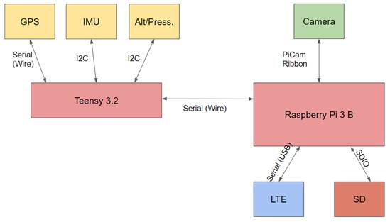

# Avionics F2019
## Project Overview and Goals
THIS IS STILL IN DEVELOPMENT (WORDING AND CONTENT WILL BE CHANGED)
The intention of this project was to create hardware and software to enable *real-time* streaming of telemetry and video data from within a medium sized rocket. The system was built and developed from the ground up. 
There were two main goals for the system:
1. Live Stream Video and Inertial Data to the World
2. Employ navigation and sensor fusion techniques to localize the payload (and hence rocket) in real time

This project has pushed the bounds in both live streaming video and telemetry data over LTE Cat M-1 and functionality given the limited amount of space in the nosecone. The hope is that future teams will be able to build off of this platform and further the success of the intern space program as a whole.

## System Diagrams
### Full System Architecture

### Payload Architecture

### Server Architecture

## Component Descriptions
- **Teensy**:The Teensy folder contains the Arduino file that allows the co-processor to go through the initiation and calibration procedure and to  sample data from the sensor suite, serializing this data via a JSON packet to be sent to the Pi for distribution.
- **Raspi**: The raspi folder is dedicated to developing the tools necessary to operate the on-board raspberry pi zero, which is responsible for: 
  1. reading/compressing video data
  2. reading in raw telemetry from the teensy
  3. storing video and telemetry data
  4. sending video and telemetry data over the LTE network to the ground server
- **Nav**: The navigation capability keeps us updated on where the vehicle is, its velocity, and its attitude. It incorporates data from all the sensors on board to come up with an estimated state, then does some light filtering to smooth out the data before it gets transmitted to the ground.
- **Ground_station**: The ground_station folder contains scripts to operate the ground server and client, and also scripts to create and display the telemetry display GUI
- **Simulation**: the simulation folder contains scripts to generate random, but realistic trajectories and generate varying degress of sensor data from the trajectories to test and flesh out the navigation algorithms. 
- **Packetizer**: the packetizer folder contains a C-style implementation of payloading and de-payloading the raw telemetry data in a highly efficient structure and byte format. 

## Payload Setup and Dependencies
### Install Hologram Nova API
### Set Up Conda Environment
1. Install anaconda: https://www.anaconda.com/distribution/
    - Be sure to download the Python 3 version
2. From the command line, run: `conda create env -f condaenv.yml`
3. Activate the conda environment: `conda activate avionics`

## Ground Station Setup and Dependencies
### Video Streaming and Display
### GUI Display
### Screen Streaming to the World
